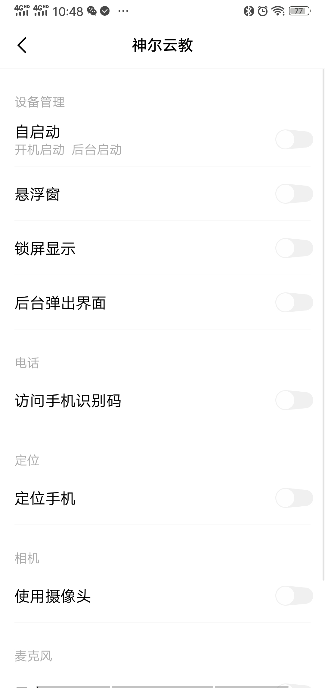
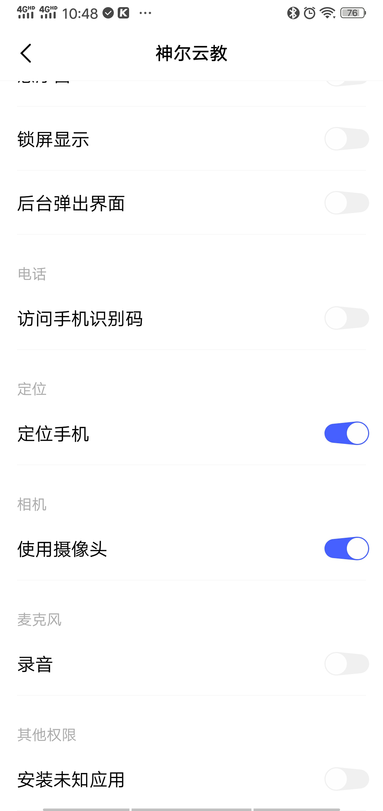

# 神尔云教

## 前言

### **关于 神尔云教**

**神尔云教 = 神尔蓝牙设备 + 神尔云App**

**神尔云教APP**是一款学习传统文化的教育软件，也是神尔旗下系列产品的配套使用软件，包含智能摇控，计划播放，内置管理等丰富功能

## 常见问题

### 连接问题

1. 安卓连接不上设备
   >1. 设备已经被其他手机连接
   >2. 自己手机蓝牙连接了其他设备（进入蓝牙页面，关闭蓝牙开关，或者取消已经配对的蓝牙）
   >3. APP弹出蓝牙权限对话框，点击允许
   >4. APP没有使用蓝牙权限（判断方法：关掉手机蓝牙，在APP如果没有提示打开蓝牙，就是没有使用蓝牙权限）
   >5. 手动开启APP使用安卓手机蓝牙,设置--应用设置--权限管理
       - 华为手机：设置--应用--权限管理
       - OPPO手机：设置--应用管理--神尔云教--应用权限
   >6. 还是无法连接，请卸载重新安装APP
2. 苹果连接不上设备
   >1. 设备已经被其他手机连接
   >2. 自己手机蓝牙连接了其他设备（进入蓝牙页面，或者忽略已经配对的蓝牙）
   >3. APP弹出蓝牙权限对话框，点击允许
   >4. 手动打开苹果手机定位服务，设置--隐私--定位服务
   >5. 手动开启APP使用苹果手机蓝牙，设置--隐私--蓝牙---神尔云教
   >6. 还是无法连接，请卸载重新安装APP

3. 问题分析
   - 场景1：重复添加，如果添加的设备已经绑定过了，是无法搜索出来的
   - 排除方法：查看设备列表页面，看看设备是否已经绑定；如已经绑定，只需首页下方-未连接设备处-正常连接就好
   ---
   - 场景2：无法获取蓝牙权限
   - 排除方法：进入蓝牙设备列表页面之后会自动搜索，如果没有自动搜索，就是没获取到蓝牙权限
   - 解决方法：卸载重新安装APP
   ---
   - 场景3只是暂时没有搜索到而已
   - 排除方法：多刷新几次，或者到设置页面查看-蓝牙是否已连接
   ---
   - 场景4：设备已经被其他手机连接
   - 排除方法：检查是否被其他手机连接，其他手机断开设备连接
   ---
   - 场景5：手机蓝牙连接了其他设备
   - 排除方法：**安卓**进入手机设置蓝牙页面，取消已经配对的蓝牙
   - 排除方法：**苹果**进入手机设置蓝牙页面，忽略已经配对的蓝牙
   ---
   - 场景6：重复添加，如果添加的设备已经绑定过了，是无法搜索出来的
   - 排除方法：查看设备列表页面，看看设备是否已经绑定；如已经绑定，只需首页下方-未连接设备处-正常连接就好

### 启动白屏
- 问题原因：APP无法获取设备型号版本，导致无法加载正确资源版本
- 解决方法：卸载重新安装APP或者升级最新版
### 设备绑定失败/设备解绑失败
- 问题原因：APP保存数据出错，或者登录超时
- 解决方法：退出账号重新登录再试，如不行则卸载重新安装APP或者升级最新版

### APP设置计划后，不能自动暂停和关机
- 问题原因：要看生产批次，去年12月前生产的机子，大部分是不支持
- 解决方法：U盘升级对应型号固件

### APP设置计划-原来有自动暂停和关机选项，现在没了
- 问题原因：要看生产批次，去年12月前生产的机子，大部分是不支持；原来有是APP没屏蔽，本身是不支持无法使用的
- 解决方法：U盘升级对应型号固件

### OPPO/VIVO-APP无法正常使用
- 问题原因：安装完毕会跳出图中页面，如用户未允许权限，则会导致APP无法正常使用
- 解决方法：卸载重新安装APP，按下图允许定位手机及使用摄像头权限权限
- | 未设置 | 设置后 |
| :------: | :------: |
|  |  |

